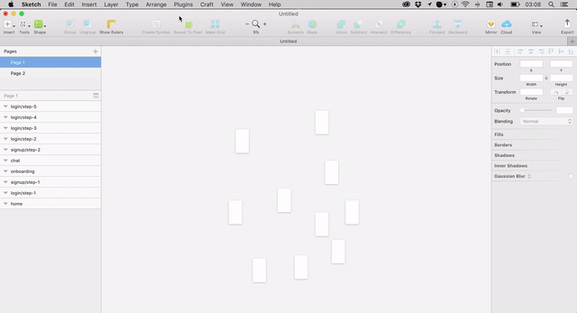

# Align Artboards Sketch Plugin

Easily aligns all artboards vertical or horizontal by name. Uses the same convention as 'Sketch export folder structure 'parent/child'.

## Usage

Normal (400px gap between artboards)  

<kbd>⇧ Shift</kbd> + <kbd>⌘ cmd</kbd> +<kbd>⌥ alt</kbd> + <kbd>1</kbd> = Align artboards horizontally.

<kbd>⇧ Shift</kbd> + <kbd>⌘ cmd</kbd> +<kbd>⌥ alt</kbd> + <kbd>2</kbd> = Align artboards vertically.

Compact (100px gap between artboards)  

<kbd>⇧ Shift</kbd> + <kbd>⌘ cmd</kbd> +<kbd>⌥ alt</kbd> + <kbd>3</kbd> = Align artboards horizontally.

<kbd>⇧ Shift</kbd> + <kbd>⌘ cmd</kbd> +<kbd>⌥ alt</kbd> + <kbd>4</kbd> = Align artboards vertically.

## Why make this plugin?

We were looking for an easy way to organise our big sketch files but couln't find a proper solution. So we created this plugin to easily organise artboards and sybmols.

## Installation

1. [Download](https://github.com/doubco/sketchplugin-align-artboards/archive/1.0.zip) the plugin
2. Double-click the file, 'Align Artboards.sketchplugin'
3. That's it...

## Contribute

Pull requests are welcome and please submit bugs 🐛.

## Contact

* Follow [@doubco](https://twitter.com/doubco) on Twitter
* Follow [@doubco](http://facebook.com/doubco) on Facebook
* Follow [@doubco](http://instagram.com/doubco) on Instagram
* Email <hi@doubco.co>
